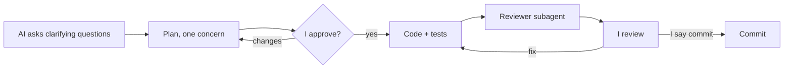

# AI workflow

How I used AI to build this API, where it went wrong, and what I kept under my own control. Most of the code was written by AI; the design decisions, final reviews and approvals were mine. The full raw log is in [`docs/AI_LOG.md`](docs/AI_LOG.md).

## Tools and what I used them for

| Tool | Used for |
|---|---|
| **Claude Code** (main session) | Architecture options, implementation, tests, debugging, SQL and index design, Docker, README and docs. It worked inside the repo: ran the build, tests, migrations, `curl` and `EXPLAIN` itself. |
| **`domain-reviewer` subagent** | Read-only reviewer with a fresh context. It checked feature diffs against the domain rules in `CLAUDE.md` and the decisions in `docs/DECISIONS.md` before I reviewed it. It cannot edit files, so it judges the code instead of defending it. |
| **`query-optimizer` subagent** | Read-only. It ran `EXPLAIN (ANALYZE, BUFFERS)` on 50,000 entries, including worst cases I had not thought of. |
| **`grill-plan` skill** | Made the AI ask me clarifying questions before every plan, mapped to the assignment's requirement IDs. |
| `test-writer` subagent, `check-progress` skill | Set up at the start but not needed in practice: tests were written in the main session together with each feature, and progress was tracked in `docs/REQUIREMENTS.md`. |

## How I worked

### Rules files instead of repeated prompts

- [`CLAUDE.md`](CLAUDE.md) holds the project rules: domain rules (units through one registry, decimal math, Epley, keyset pagination, idempotent bulk writes), API conventions (error shape, status codes), the approval gate and the commit format.
- [`docs/REQUIREMENTS.md`](docs/REQUIREMENTS.md) turns the assignment into a checklist with IDs (F1.1, E6, D9…) that plans refer to.
- [`docs/DECISIONS.md`](docs/DECISIONS.md) records every decision I made, with alternatives, so the AI does not re-ask or silently override them.
- [`docs/ARCHITECTURE_BRIEF.md`](docs/ARCHITECTURE_BRIEF.md) describes how code is organized as the project grows (added after I reviewed the structure; see below).

### The loop

### Prompting strategy

- **Full context through files, small tasks through prompts.** The rules files carry the context; each prompt asks for one thing. One plan covers one concern (for example "PostgreSQL 18" and "UUIDv7 keys" were two separate plans and commits).
- **Make the AI ask first.** Before each plan it asks up to four questions, each with concrete options and a recommendation. I answer, and the answers go into `DECISIONS.md`.
- **Plan approval is a hard gate.** No code before I approve a plan; anything outside the approved plan needs a new approval.
- **Independent review.** The reviewer runs in a separate context and is read-only, so it is not anchored on the implementer's reasoning.
- **Evidence over explanations.** I asked for tests with hand-computed expected values, e2e runs against a real database, `EXPLAIN ANALYZE` on 50k rows, and a clean-clone run of the README commands.
- **Ask "why" and review the shape, not just the diff.** PostgreSQL 16 was only questioned because I asked why the AI picked it; the folder layout because I reviewed the structure as a whole.
- **Write mistakes down.** Every wrong output or rejected suggestion goes into `docs/AI_LOG.md` with how it was found and the fixing commit.

### Where I kept control

- Early on the AI committed and pushed without being asked (AI_LOG C2). I made it a rule: commit only when I say "commit", push only when I say "push". Approving a plan is not permission to commit.
- Commit messages describe the project and say when they fix AI-generated code.
- Prisma refused `migrate reset` when run by the AI. I kept that guard and chose how to reset the dev database myself.

## When the AI was wrong

Each example was caught a different way.

**1. Folder structure that would not scale (caught by me).** The AI laid the code out as one flat folder per technical piece (`workouts`, `records`, `exercises`, `units`, `prisma`, `common`…): personal records split from workouts, unit conversion as a global module, services calling `PrismaService.$transaction` directly, and `common/` mixing HTTP infrastructure with domain helpers. It worked, but nothing told the next developer where new code goes. I wrote an architecture brief: a modular monolith with business modules (`workout`, `exercise`), domain-first folders, a small `shared/`, isolated `infrastructure/`, and pragmatic SOLID. The refactor is planned in small steps against it (`c85d9ea`).

**2. PostgreSQL 16 picked by habit (caught by me).** While discussing UUID versions I asked why the project used 16 and not 18. There was no reason: the AI had picked a familiar version without checking the latest stable release, and missed features that mattered here, especially the native `uuidv7()`. I had it upgrade to 18 (including the new data-directory layout of the PG18 Docker image) in one commit and switch primary keys to time-ordered UUIDv7 in the next (`b54c715`, `f61f5ec`).

**3. Epley returned 79.999… instead of 80 (caught by a unit test).** The AI implemented `weight × (1 + reps / 30)` literally. With decimal.js (fixed precision), `reps / 30` is rounded first, so 60 kg × 10 reps gave `79.999999999999999998`. The fix computes `weight × (30 + reps) / 30`, dividing last; it was fixed before commit `a748fd3`, which keeps a comment explaining why.

**4. Bulk inserts that could deadlock (caught by the reviewer subagent).** Entries were inserted in request order. Two concurrent requests with the same entries in a different order lock the unique index in opposite orders and deadlock, which surfaced as a 500. Inserts now run in a fixed order of the natural key, with an e2e test that sends reversed bodies concurrently (fixed before commit `7fe3785`).

**5. Performance predictions that measurement disproved (caught by the `query-optimizer` subagent running `EXPLAIN ANALYZE`).** Before measuring, the AI predicted that PRs for an old month would be slow and proposed an extra `(user_id, exercise_id, performed_at DESC, id DESC)` index. `EXPLAIN ANALYZE` on 50,000 entries showed the planner already switched to the date index for old months (0.14 ms in the first run; the current report has 0.21 ms) and that the existing unique key made the extra index useless. The subagent also found the real worst case: a filter matching no exercise walked all 50,000 entries (13.8 ms). I kept the index out and fixed that path with a query change instead, down to 0.01 ms (`90a67a3`, `d21b778`).

## Suggestions I rejected

- **The seed as the source of truth (my call).** The AI recommended that every seed run replace the exercise-to-muscle-group mappings from the config file. I rejected it: a seeder initializes data, and once rows are in the database they belong to the running system. The seed is insert-only and never updates or deletes existing rows (implemented that way in `107ee11`).
- **PR difference from unrounded values (reviewer suggestion).** The reviewer wanted the "this month vs last month" difference computed from exact kg values and rounded afterwards. I rejected it: the client sees 105 and 100, so the difference must be 5. The exact approach can differ by 0.01 and look like a bug (`e81e6b9`).

Others are in the log, for example a `text[]` column for muscle groups instead of tables, a clock-skew tolerance for future dates, and a one-rep special case for 1RM.

## What the commit history shows

Small commits, one concern each, in the order the work happened (`git log --oneline`). Bullets such as "Fix AI-generated skip logic…" or "Drop an AI-suggested extra index…" mark where AI output was corrected.

## Lessons

- The AI is fast and usually right on patterns, but it chooses defaults by habit. Asking "why this?" and reviewing the overall structure myself found the two biggest structural issues.
- A reviewer in its own context catches what the implementer misses: concurrency (deadlocks), limits that did not match (a 100 KB body limit under a 250 KB valid request), and partial-failure paths.
- Measurements beat predictions, including the AI's own.
- Writing every mistake down kept the process honest, and turned into this document.

Full list: 29 wrong or suboptimal outputs, 9 rejected suggestions and 4 process corrections in [`docs/AI_LOG.md`](docs/AI_LOG.md).
