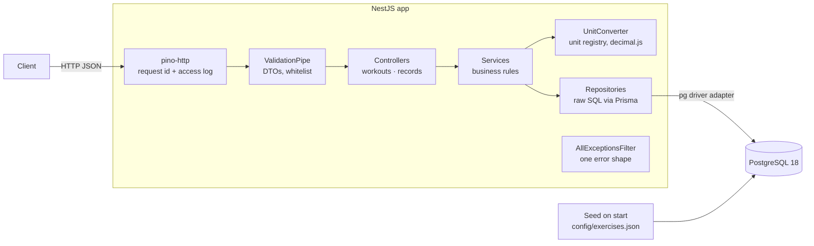
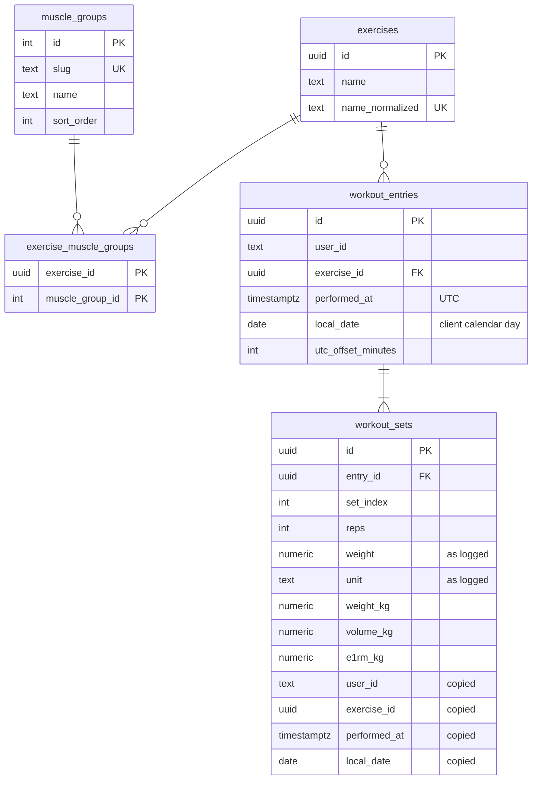

# Everfit Workout Logging API

A NestJS + PostgreSQL API that lets coaches log client workouts (in kg or lb), browse workout history and track personal records over time. It is built for correctness under retries and concurrent writes, and for fast reads at 50,000+ entries per user.

- [Quick start](#quick-start)
- [Architecture](#architecture)
- [API](#api)
- [Database](#database)
- [Key design decisions](#key-design-decisions)
- [Testing](#testing)
- [Production readiness](#production-readiness)
- [Performance](#performance)
- [Trade-offs](#trade-offs)
- [Scaling to 10,000 concurrent coaches](#scaling-to-10000-concurrent-coaches)
- [AI-assisted workflow](#ai-assisted-workflow)
- [Local development without Docker](#local-development-without-docker)

## Quick start

```bash
docker compose up --build
```

The app container applies migrations, seeds the exercise catalog (31 exercises, 12 muscle groups from [`config/exercises.json`](config/exercises.json)) and starts the API.

- API: `http://localhost:3000/api/v1`
- Swagger UI: `http://localhost:3000/docs`

Try it:

```bash
# Log two exercises in one request (mixed units)
curl -X POST localhost:3000/api/v1/users/coach-1/workouts \
  -H 'Content-Type: application/json' \
  -d '{"entries":[
        {"date":"2026-10-05T18:00:00+07:00","exerciseName":"Deadlift",
         "sets":[{"reps":5,"weight":315,"unit":"lb"},{"reps":3,"weight":160,"unit":"kg"}]},
        {"date":"2026-10-05T18:30:00+07:00","exerciseName":"Bench Press",
         "sets":[{"reps":8,"weight":80,"unit":"kg"}]}]}'

# History in lb, back exercises only
curl 'localhost:3000/api/v1/users/coach-1/workouts?unit=lb&muscleGroup=back'

# Deadlift PRs this month vs last month
curl 'localhost:3000/api/v1/users/coach-1/records?exercise=deadlift&from=2026-10-01&to=2026-10-31&compareFrom=2026-09-01&compareTo=2026-09-30'
```

Sending the same POST again returns `200` with every entry marked `duplicate`. Nothing is stored twice.

## Architecture



| Module | Responsibility |
|---|---|
| `workouts` | Bulk logging and history (controller, service, repository, DTOs, strength metrics) |
| `records` | Personal records and range comparison |
| `exercises` | Exercise catalog lookups, name normalization, auto-create |
| `units` | Unit registry and `UnitConverter` (the only place conversion happens) |
| `common` | Error codes, `AppException`, exception filter, validation factory, cursor, date parsing |
| `config` | Env validation (fails fast) and logger setup |
| `prisma` | `PrismaService` (Prisma 7, pg adapter) |
| `database/seed` | Validated, insert-only catalog seed |

Controllers only handle HTTP. Services hold the business rules. Repositories own the SQL. Everything is wired through Nest DI.

**Bulk log request flow:**
1. The DTO validates the whole body: offset datetimes not in the future, limits, units from the registry. Any error rejects the entire request with 400.
2. The service normalizes exercise names, converts weights to kg and computes volume and Epley 1RM per set. This step is pure code, with no DB access.
3. In one transaction, missing exercises are created (`ON CONFLICT DO NOTHING`), then entries are inserted in a fixed order with `ON CONFLICT (user_id, exercise_id, performed_at) DO NOTHING`.
4. Entries that already existed are reported as `duplicate`. Sets are inserted only for new entries, and their denormalized columns are copied from the entry row in SQL.
5. The response is `201` if anything was created, or `200` if every entry was a duplicate.

## API

Full, always up-to-date documentation is in **Swagger UI at [`/docs`](http://localhost:3000/docs)** (OpenAPI JSON at `/docs-json`). It covers endpoints, request and response examples, limits and error codes, and it is generated from the DTOs so it stays in sync with validation.

Conventions:
- Base path `/api/v1`. No auth; `userId` is a path parameter.
- Endpoints: `POST /users/:userId/workouts` (bulk log), `GET /users/:userId/workouts` (history), `GET /users/:userId/records?exercise=` (PRs).
- Weights accept `kg` or `lb`. Responses use `?unit=` (default `kg`), rounded to 2 decimals.
- `date` must be ISO 8601 **with a UTC offset**. Date filters (`from`, `to`, …) are calendar days `YYYY-MM-DD` in the client's local time.
- Every error has the same shape `{ statusCode, code, error, message, details[], path, timestamp, requestId }`, with a stable `code` (`VALIDATION_ERROR`, `BAD_REQUEST`, `NOT_FOUND`, `CONFLICT`, `PAYLOAD_TOO_LARGE`, `INTERNAL_ERROR`). Validation `details` point to the exact field, for example `entries[3].sets[1].weight`.

## Database



**Why PostgreSQL:** the workload is relational and aggregation-heavy. PRs are top-1 lookups per user and exercise, which map directly onto composite B-tree indexes. Bulk logging needs transactions and unique constraints, and the data shape is fixed, so MongoDB's flexibility buys nothing here ([details](docs/DECISIONS.md#2026-10-08--database-postgresql)).

**Normalization:** the catalog is normalized: exercises, muscle groups and a join table, seeded from config. `workout_sets` is deliberately denormalized. Each set stores the original `weight` and `unit`, the precomputed `weight_kg`, `volume_kg` and `e1rm_kg` (numeric, 6 decimals), and copies of `user_id`, `exercise_id`, `performed_at` and `local_date`. PR queries therefore need no join and no computation at read time. The copies are written from the entry row in SQL, so they cannot drift. Entries are immutable, which keeps the write-time cost acceptable ([details](docs/DECISIONS.md#2026-10-08--sets-storage-and-pr-strategy)).

**Indexing strategy:**

| Index | Serves |
|---|---|
| `workout_entries (user_id, performed_at DESC, id DESC)` | History listing and keyset cursor `(performed_at, id) < (…)` |
| `workout_entries UNIQUE (user_id, exercise_id, performed_at)` | Idempotency / concurrent-write guard; history filtered by exercise |
| `workout_sets (user_id, exercise_id, weight_kg DESC)` | Heaviest-set PR (top-1) |
| `workout_sets (user_id, exercise_id, volume_kg DESC)` | Highest-volume PR (top-1) |
| `workout_sets (user_id, exercise_id, e1rm_kg DESC)` | Best estimated 1RM PR (top-1) |
| `workout_sets (user_id, exercise_id, local_date)` | PRs within a calendar range (this month vs last month) |
| `workout_sets UNIQUE (entry_id, set_index)` | Set order; join from entries |
| `exercises UNIQUE (name_normalized)` | Name lookup, auto-create race safety |
| `exercise_muscle_groups (muscle_group_id)` | Muscle-group filter |

Partial name search runs on the small `exercises` table, and its ids then filter entries, so no trigram index is needed. Hand-written CHECK constraints (`reps > 0`, `weight >= 0`, offset within ±14h) back up request validation.

## Key design decisions

Each item is a summary. [`docs/DECISIONS.md`](docs/DECISIONS.md) has the alternatives and full reasoning.

- **Timezone strategy.** Clients send ISO datetimes with an offset. We store `performed_at` in UTC for ordering, ranges and pagination, plus `local_date` (the client's calendar day) and the offset. Calendar questions use `local_date`, so a 6am workout on Nov 1 in UTC+7 counts in November, even though it is still Oct 31 in UTC. Trade-off: the offset is a snapshot, not an IANA zone ([details](docs/DECISIONS.md#2026-10-08--time-and-timezone)).
- **Units.** A registry `{ kg: 1, lb: 0.45359237 }` is the single source for validation and conversion. Adding `stone` is one line. All math uses decimal.js ([details](docs/DECISIONS.md#2026-10-08--units-decimal-math-and-1rm)).
- **Idempotency and concurrent writes.** A natural key, UNIQUE `(user_id, exercise_id, performed_at)` with `ON CONFLICT DO NOTHING`, makes retries and simultaneous identical requests store exactly one copy. Inserts run in a fixed order so that concurrent requests listing the same entries in a different order cannot deadlock ([details](docs/DECISIONS.md#2026-10-08--idempotency-and-concurrent-writes)).
- **Bulk logging.** Synchronous, one transaction, all-or-nothing after validating the whole request. Limits: ≤ 100 entries, ≤ 50 sets, reps 1–1000, weight 0–2000 in the submitted unit. The JSON body limit is raised to 1 MB to fit the largest valid request ([details](docs/DECISIONS.md#2026-10-08--bulk-logging)).
- **Pagination.** An opaque keyset cursor instead of OFFSET, so each page costs O(page size) even at 50k+ entries ([details](docs/DECISIONS.md#2026-10-08--workout-history)).
- **Personal records.** Three indexed top-1 lookups in one SQL statement. 1RM uses the Epley formula as specified, applied to every set. When a value is reached again, the most recent set is reported. Comparison takes an explicit second date range ([details](docs/DECISIONS.md#2026-10-08--personal-records)).
- **Configurable muscle groups.** The mapping lives in `config/exercises.json`. The seed is validated and insert-only: it never rewrites stored data. Unknown exercise names are created on the fly without muscle groups ([details](docs/DECISIONS.md#2026-10-08--seeding-the-exercise-catalog)).

## Testing

```bash
npm ci
npm test                    # unit tests (no DB); generates the Prisma client first
docker compose up -d db     # e2e needs Postgres (database everfit_test, created on first start)
npm run test:e2e            # migrates, wipes and seeds everfit_test, then runs e2e tests
npm run docs:check          # validates the OpenAPI document of a running built app
```

- **Unit (81):** unit conversion (incl. adding `stone`), Epley and volume (incl. rounding pitfalls), decimal rounding, date and offset parsing, cursor encoding, env validation, log serializers, exception filter, validation error paths, catalog config validation.
- **E2E (79):** every endpoint through the real HTTP pipeline and Postgres:
  - logging in mixed units, auto-created exercises
  - idempotent retries, concurrent identical and reversed-order requests
  - every validation edge case (invalid unit, null date, missing offset, future date, negative weight, zero reps, empty sets, limits, unknown fields)
  - history filters, unit conversion, pagination without gaps or duplicates, empty ranges
  - PR values, ties and comparisons
  - DB constraints (unique, cascade, CHECK)
  - the largest valid bulk request

Tests are named by behavior and assert exact values computed by hand, never re-computed with the implementation's formula.

## Production readiness

- **Docker:** multi-stage image running as a non-root user. Migrations and the seed run on start. Postgres has a TCP healthcheck, and the app waits for it.
- **Configuration:** env vars are validated at startup with class-validator. A missing or invalid value stops the app with a message listing every problem. See [`.env.example`](.env.example).
- **Logging:** structured JSON logs (pino) with one line per request (except requests rejected by the body parser, see backlog B1) and a request id, taken from `x-request-id` or generated, echoed back and included in error bodies. Bodies and headers are never logged. Pretty output in development only.
- **Errors:** one error shape. 5xx responses never expose internals; the stack goes to the log only.
- **Limits and validation:** strict DTO validation with whitelist and unknown fields rejected, request size limits, DB CHECK constraints as a second line of defense.

## Performance

> **Pending:** a script seeds 50,000+ entries for one user, and `EXPLAIN ANALYZE` is run on the history (unfiltered, by exercise, by muscle group, by date range, deep cursor) and PR (all-time, range, comparison) queries. The results table will be added here.

## Trade-offs

- **No update or delete endpoint.** The assignment does not ask for one. A retry with different sets for an existing entry is reported as `duplicate`, and the stored sets are kept.
- **Unparsable JSON** returns `BAD_REQUEST` rather than a dedicated code. Nest maps body-parser errors before the exception filter (see backlog B1 in `docs/REQUIREMENTS.md`).
- **No cache.** PRs are computed on read from indexes, which is fast and always consistent. A cache would add invalidation on every write.
- **PR `difference`** is computed from the rounded values shown to the client, so it can differ from the exact difference by at most 0.01.
- **Offset, not IANA timezone.** Correct for the logged moment, but we cannot re-derive local time under a different DST rule.
- **Zero tolerance for future timestamps.** A client clock running ahead can get a 400 for "now".
- **Denormalized set columns** trade some write cost and storage for join-free, index-backed top-1 PR lookups.

## Scaling to 10,000 concurrent coaches

- **Connections:** run several stateless app instances behind a load balancer, with PgBouncer in transaction mode in front of Postgres.
- **Reads:** route history and PR queries to read replicas. Writes stay on the primary.
- **Hot data:** cache PR responses per `(user, exercise, range)` in Redis and invalidate them on writes for that user and exercise. Optionally maintain a small "all-time PR" table asynchronously.
- **Data growth:** partition `workout_sets` and `workout_entries` by hash of `user_id`. Every query is per user, so partitions prune well. Archive old partitions to cheaper storage.
- **Write path:** keep logging synchronous, but move side effects (PR notifications, analytics, exports) to a queue (e.g. BullMQ or SQS) via an outbox table. Large historical imports go through a background job.
- **Protection:** rate limit per user and coach, enforce request size limits, set timeouts and statement timeouts.
- **Observability:** add metrics (p95 latency per endpoint, DB pool usage, slow queries via `pg_stat_statements`) next to the request-id logs, and alert on error rate.

## AI-assisted workflow

This project was built with Claude Code under explicit rules ([`CLAUDE.md`](CLAUDE.md)): a clarifying-questions step before every plan, plan approval before code, and a read-only reviewer subagent on every diff. See [`AI_WORKFLOW.md`](AI_WORKFLOW.md) for the process and [`docs/AI_LOG.md`](docs/AI_LOG.md) for every AI mistake that was caught and every suggestion that was rejected.

## Local development without Docker

Requires Node 24 and a PostgreSQL 18 instance (or `docker compose up -d db`).

```bash
npm ci
cp .env.example .env          # adjust DATABASE_URL if needed
npx prisma migrate deploy     # apply migrations
npm run build                 # also generates the Prisma client
npm run db:seed               # seed the exercise catalog (insert-only, safe to re-run)
npm run start:dev             # http://localhost:3000/api/v1, docs at /docs
```
