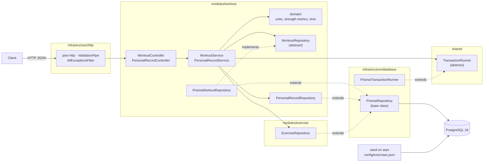
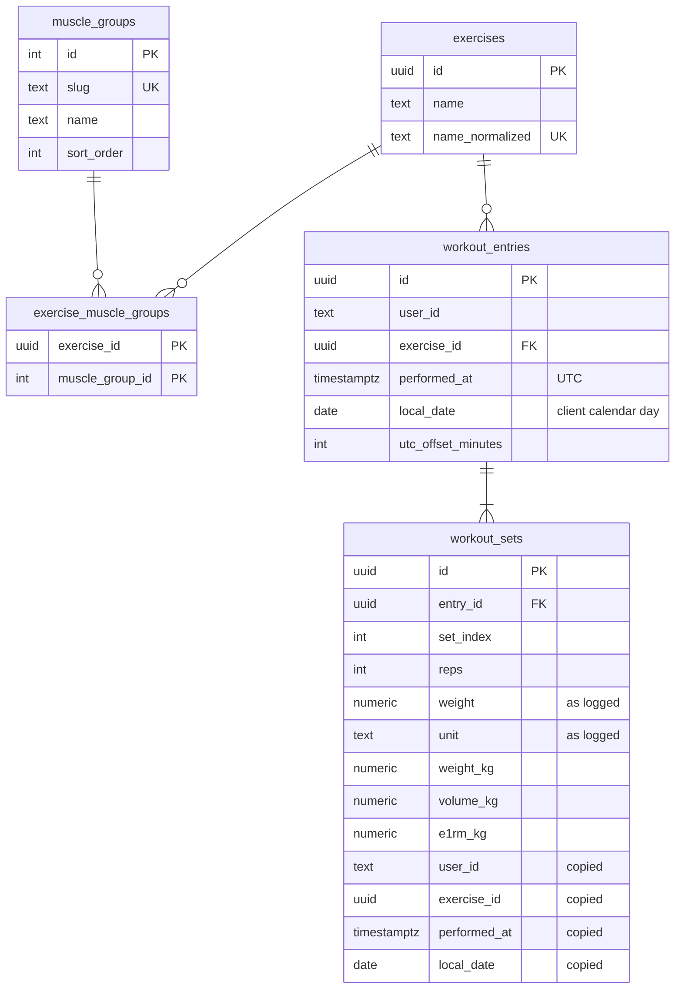

# Everfit Workout Logging API

A NestJS + PostgreSQL API that lets coaches log client workouts (in kg or lb), browse workout history and track personal records over time. It is built for correctness under retries and concurrent writes, and for fast reads at 50,000+ entries per user.

- [Quick start](#quick-start)
- [Architecture](#architecture)
- [API](#api)
- [Database](#database)
- [Key design decisions](#key-design-decisions)
- [Testing](#testing)
- [Production readiness](#production-readiness)
- [Performance](#performance)
- [Trade-offs](#trade-offs)
- [Scaling to 10,000 concurrent coaches](#scaling-to-10000-concurrent-coaches)
- [AI-assisted workflow](#ai-assisted-workflow)
- [Local development without Docker](#local-development-without-docker)

## Quick start

```bash
docker compose up --build
```

The app container applies migrations, seeds the exercise catalog (31 exercises, 12 muscle groups from [`config/exercises.json`](config/exercises.json)) and starts the API.

- API: `http://localhost:3000/api/v1`
- Swagger UI: `http://localhost:3000/docs`

Try it:

```bash
# Log two exercises in one request (mixed units)
curl -X POST localhost:3000/api/v1/users/coach-1/workouts \
  -H 'Content-Type: application/json' \
  -d '{"entries":[
        {"date":"2026-10-05T18:00:00+07:00","exerciseName":"Deadlift",
         "sets":[{"reps":5,"weight":315,"unit":"lb"},{"reps":3,"weight":160,"unit":"kg"}]},
        {"date":"2026-10-05T18:30:00+07:00","exerciseName":"Bench Press",
         "sets":[{"reps":8,"weight":80,"unit":"kg"}]}]}'

# History in lb, back exercises only
curl 'localhost:3000/api/v1/users/coach-1/workouts?unit=lb&muscleGroup=back'

# Deadlift PRs this month vs last month
curl 'localhost:3000/api/v1/users/coach-1/records?exercise=deadlift&from=2026-10-01&to=2026-10-31&compareFrom=2026-09-01&compareTo=2026-09-30'
```

Sending the same POST again returns `200` with every entry marked `duplicate`. Nothing is stored twice.

Optional sample data (about 7 seconds; safe to re-run, and a run interrupted midway is completed by running it again):

```bash
docker compose exec app npm run db:seed:demo
```

This adds `perf-user` with 50,000 entries and `demo-user-01` … `demo-user-20` with 500 entries each, so `/users/demo-user-01/workouts` and `/users/perf-user/records?exercise=squat` return data right away.

## Architecture

A modular monolith: code is grouped by business capability first and by technical layer second, so each domain can grow (or later be extracted into its own service) without mixing with the others. The rules are in [`docs/ARCHITECTURE_BRIEF.md`](docs/ARCHITECTURE_BRIEF.md).



```text
src/
├── modules/                 business capabilities
│   ├── workout/             logging, history, personal records, unit conversion
│   │   ├── controllers/     HTTP only: DTOs in, response shapes out; Swagger docs in *.docs.ts
│   │   ├── services/        business rules and orchestration
│   │   ├── repositories/    WorkoutRepository contract + Prisma implementations
│   │   ├── dto/             requests/, responses/, validators/
│   │   └── domain/          pure logic: unit registry and converter, Epley, time parsing
│   └── exercise/            exercise catalog, muscle groups, name normalization
├── shared/                  kept small: errors, Swagger response decorators, transaction contract
└── infrastructure/          HTTP pipeline, config, logging, Prisma, seed and perf scripts
```

| Area | Responsibility |
|---|---|
| `modules/workout` | Bulk logging, history with filters and cursor pagination, personal records and comparisons. Owns unit conversion, since only this domain uses it |
| `modules/exercise` | Exercise catalog lookups, name normalization, auto-create, muscle-group filters |
| `shared` | `AppException` and error codes, Swagger error decorators, the `TransactionRunner` contract |
| `infrastructure` | HTTP pipeline (logging, validation, exception filter, Swagger setup), validated config, Prisma client, transaction runner, base repository, seed and performance scripts |

Dependencies point one way: `workout` uses `exercise`, never the reverse, and business modules never import `infrastructure/http`. `app.module.ts` wires everything through Nest DI.

**Design principles (SOLID, applied pragmatically):**
- **Single responsibility:** controllers handle HTTP, services hold business rules, repositories own SQL, and `domain/` is plain logic with no framework imports.
- **Open/closed:** adding a unit (stone) is one registry entry; adding another workout persistence implementation is a new class, not a change to `WorkoutService`.
- **Liskov substitution:** `WorkoutRepository` documents its contract (natural-key idempotency, ordering, `limit + 1`); the Prisma implementation and the unit-test doubles honor it.
- **Interface segregation:** `TransactionRunner` has one method; `WorkoutRepository` exposes only the five operations the service uses.
- **Dependency inversion:** services depend on `TransactionRunner` and `WorkoutRepository`, not on Prisma. Writes take the transaction as a required argument, so a write cannot silently run outside it.

Abstractions exist only where they mark a real boundary; the personal-record and exercise repositories stay concrete classes that share a small `PrismaRepository` base.

**Bulk log request flow:**
1. The DTO validates the whole body: offset datetimes not in the future, limits, units from the registry. Any error rejects the entire request with 400.
2. `WorkoutService` normalizes exercise names, converts weights to kg and computes volume and Epley 1RM per set. This step is pure code, with no DB access.
3. Inside one `TransactionRunner.run`, missing exercises are created (`ON CONFLICT DO NOTHING`), then entries are inserted in a fixed order with `ON CONFLICT (user_id, exercise_id, performed_at) DO NOTHING`.
4. Entries that already existed are reported as `duplicate`. Sets are inserted only for new entries, and their denormalized columns are copied from the entry row in SQL.
5. The response is `201` if anything was created, or `200` if every entry was a duplicate.

## API

Full, always up-to-date documentation is in **Swagger UI at [`/docs`](http://localhost:3000/docs)** (OpenAPI JSON at `/docs-json`). It covers endpoints, request and response examples, limits and error codes, and it is generated from the DTOs so it stays in sync with validation.

Conventions:
- Base path `/api/v1`. No auth; `userId` is a path parameter.
- Endpoints: `POST /users/:userId/workouts` (bulk log), `GET /users/:userId/workouts` (history), `GET /users/:userId/records?exercise=` (PRs).
- Weights accept `kg` or `lb`. Responses use `?unit=` (default `kg`), rounded to 2 decimals.
- `date` must be ISO 8601 **with a UTC offset**. Date filters (`from`, `to`, …) are calendar days `YYYY-MM-DD` in the client's local time.
- Every error has the same shape `{ statusCode, code, error, message, details[], path, timestamp, requestId }`, with a stable `code` (`VALIDATION_ERROR`, `BAD_REQUEST`, `NOT_FOUND`, `CONFLICT`, `PAYLOAD_TOO_LARGE`, `INTERNAL_ERROR`). Validation `details` point to the exact field, for example `entries[3].sets[1].weight`.

## Database



**Why PostgreSQL:** the workload is relational and aggregation-heavy. PRs are top-1 lookups per user and exercise, which map directly onto composite B-tree indexes. Bulk logging needs transactions and unique constraints, and the data shape is fixed, so MongoDB's flexibility buys nothing here ([details](docs/DECISIONS.md#2026-10-08--database-postgresql)).

**Normalization:** the catalog is normalized: exercises, muscle groups and a join table, seeded from config. `workout_sets` is deliberately denormalized. Each set stores the original `weight` and `unit`, the precomputed `weight_kg`, `volume_kg` and `e1rm_kg` (numeric, 6 decimals), and copies of `user_id`, `exercise_id`, `performed_at` and `local_date`. PR queries therefore need no join and no computation at read time. The copies are written from the entry row in SQL, so they cannot drift. Entries are immutable, which keeps the write-time cost acceptable ([details](docs/DECISIONS.md#2026-10-08--sets-storage-and-pr-strategy)).

**Primary keys:** UUIDv7 generated by PostgreSQL (`uuidv7()`), so inserts append to the primary-key index instead of scattering like random v4 ids. History is still ordered by `performed_at`, with `id` only as a tie-breaker ([details](docs/DECISIONS.md#2026-10-08--primary-keys-uuidv7)).

**Indexing strategy:**

| Index | Serves |
|---|---|
| `workout_entries (user_id, performed_at DESC, id DESC)` | History listing and keyset cursor `(performed_at, id) < (…)` |
| `workout_entries UNIQUE (user_id, exercise_id, performed_at)` | Idempotency / concurrent-write guard; history filtered by exercise |
| `workout_sets (user_id, exercise_id, weight_kg DESC)` | Heaviest-set PR (top-1) |
| `workout_sets (user_id, exercise_id, volume_kg DESC)` | Highest-volume PR (top-1) |
| `workout_sets (user_id, exercise_id, e1rm_kg DESC)` | Best estimated 1RM PR (top-1) |
| `workout_sets (user_id, exercise_id, local_date)` | PRs within a calendar range (this month vs last month) |
| `workout_sets UNIQUE (entry_id, set_index)` | Set order; join from entries |
| `exercises UNIQUE (name_normalized)` | Name lookup, auto-create race safety |
| `exercise_muscle_groups (muscle_group_id)` | Muscle-group filter |

Partial name search runs on the small `exercises` table, and its ids then filter entries, so no trigram index is needed. Hand-written CHECK constraints (`reps > 0`, `weight >= 0`, offset within ±14h) back up request validation.

## Key design decisions

Each item is a summary. [`docs/DECISIONS.md`](docs/DECISIONS.md) has the alternatives and full reasoning.

- **Timezone strategy.** Clients send ISO datetimes with an offset. We store `performed_at` in UTC for ordering, ranges and pagination, plus `local_date` (the client's calendar day) and the offset. Calendar questions use `local_date`, so a 6am workout on Nov 1 in UTC+7 counts in November, even though it is still Oct 31 in UTC. Trade-off: the offset is a snapshot, not an IANA zone ([details](docs/DECISIONS.md#2026-10-08--time-and-timezone)).
- **Units.** A registry `{ kg: 1, lb: 0.45359237 }` is the single source for validation and conversion. Adding `stone` is one line. All math uses decimal.js ([details](docs/DECISIONS.md#2026-10-08--units-decimal-math-and-1rm)).
- **Idempotency and concurrent writes.** A natural key, UNIQUE `(user_id, exercise_id, performed_at)` with `ON CONFLICT DO NOTHING`, makes retries and simultaneous identical requests store exactly one copy. Inserts run in a fixed order so that concurrent requests listing the same entries in a different order cannot deadlock ([details](docs/DECISIONS.md#2026-10-08--idempotency-and-concurrent-writes)).
- **Bulk logging.** Synchronous, one transaction, all-or-nothing after validating the whole request. Limits: ≤ 100 entries, ≤ 50 sets, reps 1–1000, weight 0–2000 in the submitted unit. The JSON body limit is raised to 1 MB to fit the largest valid request ([details](docs/DECISIONS.md#2026-10-08--bulk-logging)).
- **Pagination.** An opaque keyset cursor instead of OFFSET, so each page costs O(page size) even at 50k+ entries ([details](docs/DECISIONS.md#2026-10-08--workout-history)).
- **Personal records.** Three indexed top-1 lookups in one SQL statement. 1RM uses the Epley formula as specified, applied to every set. When a value is reached again, the most recent set is reported. Comparison takes an explicit second date range ([details](docs/DECISIONS.md#2026-10-08--personal-records)).
- **Configurable muscle groups.** The mapping lives in `config/exercises.json`. The seed is validated and insert-only: it never rewrites stored data. Unknown exercise names are created on the fly without muscle groups ([details](docs/DECISIONS.md#2026-10-08--seeding-the-exercise-catalog)).

## Testing

```bash
npm ci
npm run typecheck           # type-check src and tests (Vitest strips types without checking them)
npm test                    # unit tests (no DB); generates the Prisma client first
docker compose up -d db     # e2e needs Postgres (database everfit_test, created on first start)
npm run test:e2e            # migrates, wipes and seeds everfit_test, then runs e2e tests
npm run docs:check          # validates the OpenAPI document of a running built app
```

- **Unit (105):** unit conversion (incl. adding `stone`), Epley and volume (incl. rounding pitfalls), decimal rounding, date and offset parsing, cursor encoding, env validation, log serializers, exception filter, validation error paths, catalog config validation, bulk-logging status counting and single-transaction writes, demo data generator (determinism, validation limits, local dates), EXPLAIN plan parsing and percentiles.
- **E2E (87):** every endpoint through the real HTTP pipeline and Postgres:
  - logging in mixed units, auto-created exercises
  - idempotent retries, concurrent identical and reversed-order requests
  - every validation edge case (invalid unit, null date, missing offset, future date, negative weight, zero reps, empty sets, limits, unknown fields)
  - history filters, unit conversion, pagination without gaps or duplicates, empty ranges
  - PR values, ties and comparisons
  - DB constraints (unique, cascade, CHECK) and UUIDv7 keys
  - demo seeding (batches, copied set columns, re-run and resume after a partial run)
  - the largest valid bulk request

E2E tests are grouped like the code: `test/modules/workout` (endpoints) and `test/infrastructure` (database constraints, seeds, HTTP pipeline, Swagger).

Tests are named by behavior and assert exact values computed by hand, never re-computed with the implementation's formula.

## Production readiness

- **Docker:** multi-stage image running as a non-root user. Migrations and the seed run on start. Postgres has a TCP healthcheck, and the app waits for it.
- **Configuration:** env vars are validated at startup with class-validator. A missing or invalid value stops the app with a message listing every problem. See [`.env.example`](.env.example).
- **Logging:** structured JSON logs (pino) with one line per request (except requests rejected by the body parser, see backlog B1) and a request id, taken from `x-request-id` or generated, echoed back and included in error bodies. Bodies and headers are never logged. Pretty output in development only.
- **Errors:** one error shape. 5xx responses never expose internals; the stack goes to the log only.
- **Limits and validation:** strict DTO validation with whitelist and unknown fields rejected, request size limits, DB CHECK constraints as a second line of defense.

## Performance

**Dataset:** `npm run db:seed:demo` generates deterministic history (fixed-seed PRNG, fixed end date `2026-09-30`; the same catalog config gives the same data): `perf-user` has 50,000 entries and about 175,000 sets over five years, next to 20 users with 500 entries each, so every query must stay scoped by `user_id`. Weights progress over time, about 20% of sessions are logged in lb, and users have different UTC offsets. The density (several sessions a day) is higher than real life on purpose: query cost depends on rows per user, not on how they are spread. Rows are written with the API's own repository SQL and metric code (`computeSetMetrics`), so stored kg, volume and 1RM values match what the API writes ([details](docs/DECISIONS.md#2026-10-08--demo-and-performance-seed-data)).

**Results** (PostgreSQL 18.6, `perf-user` with 50,000 entries and 174,636 sets; full plans in [docs/PERFORMANCE.md](docs/PERFORMANCE.md)):

| Query | Plan | DB time | HTTP p50 / p95 |
|---|---|---|---|
| History, first page (20 / 100) | Index Scan on `(user_id, performed_at DESC, id DESC)`, stops after `limit + 1` rows, no sort | 0.30 / 0.48 ms | 3.4 / 5.8 ms |
| History, deep page (cursor after 49,000 entries) | Same index, cursor becomes the index start | 0.15 ms | 3.7 / 5.3 ms |
| History by exercise / muscle group (incl. with month and cursor) | Exercise ids resolved on the 31-row catalog first, then `exercise_id = ANY(…)` on the unique key or history index | 0.25–0.42 ms | 4.3–4.7 / 5.3–6.4 ms |
| History for one month | History index bounded by the widened `performed_at` range, exact match on `local_date` | 0.49 ms | 4.2 / 5.4 ms |
| Sets for a page of 100 entries | `UNIQUE (entry_id, set_index)` | 0.09 ms | — |
| PRs, all time | Three top-1 Index Scans on the `(user_id, exercise_id, <metric> DESC)` indexes | 0.08 ms | 2.7 / 3.9 ms |
| PRs, one month / month vs month | Planner picks the metric index or `(user_id, exercise_id, local_date)` by range | 0.12–0.28 ms | 3.1–3.6 / 4.5–5.1 ms |
| Exercise filter matching nothing (former worst case) | Catalog lookup finds no ids, history is not queried | **0.01 ms** (was 13.8 ms) | 2.3 / 2.8 ms (was 13.0 / 14.2 ms) |

Re-run with `npm run db:seed:demo && npm run build && npm run db:explain` (the app must be running for the HTTP columns).

**Findings:**
- Keyset pagination keeps the deepest page as fast as the first one: OFFSET would read and discard 49,000 rows.
- Each PR is one index lookup that reads a handful of rows, independent of history size. The denormalized metric columns are what make this possible.
- No new index is needed for the 50k target. A suggested `(user_id, exercise_id, performed_at DESC, id DESC)` index was measured and rejected: the existing unique key already orders entries within an exercise.
- The first measurement found one path that grew with history size: a filter matching no exercise walked all 50,000 entries (13.8 ms). Resolving exercise ids on the catalog first and returning early when there are none removed it (0.01 ms). The fix was a query change, not an index. For a filter that matches exercises the client rarely trains, the plan depends on the planner's estimate and may walk part of the history index; reading each exercise through the unique key makes this bounded at larger scale (see below).
- About 3 ms of each HTTP request is the Nest pipeline, unit conversion and JSON; the database accounts for well under 1 ms.

## Trade-offs

- **No update or delete endpoint.** The assignment does not ask for one. A retry with different sets for an existing entry is reported as `duplicate`, and the stored sets are kept.
- **Unparsable JSON** returns `BAD_REQUEST` rather than a dedicated code. Nest maps body-parser errors before the exception filter (see backlog B1 in `docs/REQUIREMENTS.md`).
- **No cache.** PRs are computed on read from indexes, which is fast and always consistent. A cache would add invalidation on every write.
- **PR `difference`** is computed from the rounded values shown to the client, so it can differ from the exact difference by at most 0.01.
- **Offset, not IANA timezone.** Correct for the logged moment, but we cannot re-derive local time under a different DST rule.
- **Zero tolerance for future timestamps.** A client clock running ahead can get a 400 for "now".
- **Denormalized set columns** trade some write cost and storage for join-free, index-backed top-1 PR lookups.
- **Unknown exercise names are added to the shared catalog.** Simple, and enough for one team; at scale this needs per-client custom exercises (see below).
- **Filters that match exercises the client rarely trains** still walk the client's history index until `limit` matches are found (a filter matching no exercise at all returns early). Fine for the target; the per-exercise read is described below.

## Scaling to 10,000 concurrent coaches

- **Connections:** run several stateless app instances behind a load balancer, with PgBouncer in transaction mode in front of Postgres.
- **Reads:** route history and PR queries to read replicas. Writes stay on the primary.
- **Hot data:** cache PR responses per `(user, exercise, range)` in Redis and invalidate them on writes for that user and exercise. Optionally maintain a small "all-time PR" table asynchronously.
- **Write path:** keep logging synchronous, but move side effects (PR notifications, analytics, exports) to a queue (e.g. BullMQ or SQS) via an outbox table. Large historical imports go through a background job.
- **Protection:** rate limit per user and coach, enforce request size limits, set timeouts and statement timeouts.
- **Observability:** add metrics (p95 latency per endpoint, DB pool usage, slow queries via `pg_stat_statements`) next to the request-id logs, and alert on error rate.

### Data and queries at 50 million entries

Assume millions of clients, 50 million entries in total (about 175 million sets), some clients with ten years of history, and a much larger exercise catalog.

**What still holds:** a client training five or six exercises a day for ten years has about 18,000 entries, fewer than the 50,000 measured above. Every index starts with `user_id`, so per-client queries stay as measured (history, deep cursor and PRs under 1 ms); a larger table adds about one B-tree level.

**What I would change, in order:**

1. **Per-client custom exercises.** Unknown exercise names are currently added to one shared catalog. With millions of clients that catalog fills with near-duplicates ("squat", "pause squat", typos) that everyone sees. Add `exercises.owner_user_id` (null for the curated catalog) with unique `(owner_user_id, name_normalized)`; history and PRs resolve names against the curated catalog plus the client's own exercises. This is a data-correctness change and gets harder the longer it waits.
2. **Read filtered history per exercise.** Exercise ids are already resolved on the catalog first, with an early return when none match (this removed the 13.8 ms worst case). An exercise or muscle-group filter that matches exercises the client rarely trains still walks the history index until `limit` matches are found. Read each matching exercise's entries through the existing unique key `(user_id, exercise_id, performed_at)` with a `LATERAL` subquery, then merge. Cost then depends on the number of exercises times `limit`, not on history size. No new index is needed; an extra `(user_id, exercise_id, performed_at DESC, id DESC)` index was measured and rejected.
3. **Partition `workout_entries` and `workout_sets` by hash of `user_id`** (32–64 partitions). At the measured ratios (42 MB of sets and 61 MB of PR indexes per 175,000 sets) 175 million sets come to roughly 42 GB of table and 60 GB of PR indexes, which no longer fit in memory. Every query is per client, so partitions prune well, indexes per partition stay small, vacuum runs per partition, and the layout maps directly onto sharding by `user_id` (e.g. Citus) later.
4. **Trigram index for name search** (`pg_trgm` GIN on `exercises.name_normalized`) once the catalog has tens of thousands of rows; `LIKE '%…%'` is a scan of a 31-row table today.
5. **Planner statistics.** Statistics are averaged over all clients, so a heavy and a light client can get the same plan. Raise the statistics target on `user_id` and `exercise_id`, and catch regressions with `auto_explain`.
6. **Monthly PR summary table** `(user_id, exercise_id, month)` with the best weight, volume and 1RM, updated in the logging transaction (entries are immutable, so it never needs recomputing). Range PRs then read a few rows regardless of planner choices, and the three PR indexes on `workout_sets` (six B-trees updated per set today) could be dropped to cut write cost.

## AI-assisted workflow

This project was built with Claude Code under explicit rules ([`CLAUDE.md`](CLAUDE.md)): a clarifying-questions step before every plan, plan approval before code, and a read-only reviewer subagent on every diff. See [`AI_WORKFLOW.md`](AI_WORKFLOW.md) for the process and [`docs/AI_LOG.md`](docs/AI_LOG.md) for every AI mistake that was caught and every suggestion that was rejected.

## Local development without Docker

Requires Node 24 and a PostgreSQL 18 instance (or `docker compose up -d db`).

```bash
npm ci
cp .env.example .env          # adjust DATABASE_URL if needed
npx prisma migrate deploy     # apply migrations
npm run build                 # also generates the Prisma client
npm run db:seed               # seed the exercise catalog (insert-only, safe to re-run)
npm run start:dev             # http://localhost:3000/api/v1, docs at /docs
```
